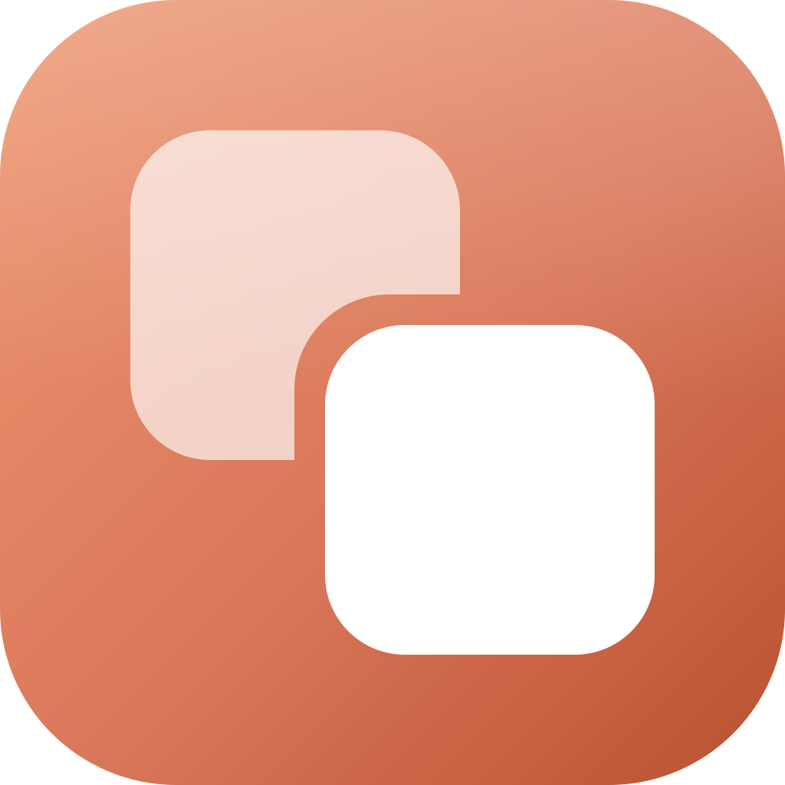

<p align="center">
  
</p>

<h1 align="center">Claudify</h1>

<p align="center">
  Run several Claude Desktop accounts side by side, on macOS and Windows.
</p>

---

A personal account and a work one, or one per client — each in its own window,
signed in at the same time.

Claude Desktop keeps its session in a single user-data directory, so it holds
one signed-in account at a time. Claudify gives each profile its own directory
and launches the Claude you already have installed against it. The result is
genuinely separate instances: separate sign-ins, separate settings, separate
MCP servers.

---

## How it works

Claude Desktop is an Electron app, and Electron accepts a `--user-data-dir`
switch that relocates everything session-related. Two facts make this usable:

1. **The single-instance lock lives inside the user-data directory.** A
   different directory means a real second process, not a second window of the
   one that is already running.
2. **Auth tokens live inside that directory too.** They are encrypted with the
   OS keystore, but the ciphertext sits in the profile folder — so separate
   folders mean separate sessions.

Claudify launches Claude's executable directly with that switch. It does **not**
go through LaunchServices or the Windows shell, because those drop or mangle
command-line arguments.

### What Claudify deliberately does not do

- **It never touches the Claude app.** No copying the bundle, no editing
  `Info.plist`, no re-signing, no patching. Claude's code signature and its
  auto-updates keep working exactly as before.
- **It never passes anything but `--user-data-dir`.** Claude refuses to start if
  its command line contains any of a set of debugging or network-override
  switches. Claudify keeps that list and validates every launch against it, so a
  bug here can't produce a command line Claude rejects — or one that weakens it.
- **It never hard-deletes.** Removing a profile moves its data to the Trash /
  Recycle Bin, so a mistake is always recoverable.
- **It strips its own runtime from the child environment.** Launching an
  Electron app from an Electron app would otherwise leak `NODE_OPTIONS` and
  `ELECTRON_RUN_AS_NODE` into Claude and break it.

### The isolation check

Twenty seconds after a launch, Claudify checks that Claude actually wrote into
the profile folder. If the folder is still empty while the process is alive, the
switch was ignored, and the profile is flagged in the UI.

This exists because the mechanism is unsupported. If a future Claude build stops
honouring `--user-data-dir`, you will see a warning instead of silently running
two windows signed in to the same account.

---

## Install

Grab the build for your platform from the
[Releases page](../../releases/latest).

| Platform | Download | Notes |
|---|---|---|
| macOS (Apple Silicon) | `Claudify-*-mac-arm64.dmg` | Open it, drag to Applications |
| macOS (Intel) | `Claudify-*-mac-x64.zip` | Unzip, move `Claudify.app` to Applications |
| Windows | `Claudify-*-win-x64-setup.exe` | Installer |
| Windows (no install) | `Claudify-*-win-x64-portable.exe` | Run in place |

Intel Macs get a `.zip` rather than a `.dmg`: the release runners are Apple
Silicon, and `hdiutil` cannot build an Intel DMG from one. The `.app` inside is
the same build.

### The builds are unsigned

Code-signing certificates cost money per year, so the released binaries are not
signed. Both systems will warn you the first time. If you would rather not work
around that, build it yourself from source below — the result is identical.

**macOS** — the first open is blocked, so either right-click the app and choose
*Open* (then *Open* again in the dialog), or clear the quarantine flag:

```bash
xattr -cr /Applications/Claudify.app
```

If macOS says **"Claudify is damaged and can't be opened"**, that is the same
problem wearing a scarier hat — it is not a corrupt download. Apple Silicon
refuses to run a binary whose signature does not check out, and reports it that
way. The command above fixes it. Builds from v1.0.1 onward are ad-hoc signed,
which downgrades this to the ordinary "unidentified developer" prompt.

**Windows** — SmartScreen shows "Windows protected your PC". Click *More info*,
then *Run anyway*.

## Build from source

You need [Node.js](https://nodejs.org) 18 or newer.

```bash
npm install
npm start
```

That runs it directly. To produce installers:

```bash
npm run dist:mac   # .dmg + .zip, arm64 and x64
npm run dist:win   # NSIS installer + portable .exe
```

They land in `release/`. Build on the platform you are targeting — packaging is
far less fussy natively than cross-compiled.

The app icon is generated from `assets/logo.svg`. If you change the mark, run
`npm run icons` to regenerate `build/icon.png`, which electron-builder converts
to `.icns` and `.ico`.

### First run

1. Click **New Profile**, give it a name and a colour.
2. Click **Open**. Claude launches signed out.
3. Sign in with the account you want that profile to hold.

Repeat for each account. Your existing Claude install keeps its own session in
the default location and is untouched — so if you already have one account
signed in there, just leave it and use Claudify for the additional ones.

---

## Notes and limits

**Each profile is a full Claude instance.** Expect a few hundred MB of RAM each.
Three or four at once is comfortable; a dozen is not.

**MCP servers are per profile — but Claudify can copy them for you.** Claude
reads `claude_desktop_config.json` from inside the user-data directory, so a new
profile starts with no servers. This is different from logging out and back in
on a normal install, where the directory never changes and your servers survive.

So the New Profile dialog offers to copy them across, defaulting to your main
Claude install, and the row menu has *Copy MCP config from…* to do it later or
from another profile. *Edit MCP config* opens a profile's file directly.

Only `claude_desktop_config.json` is ever copied — never Local Storage, cookies,
or anything else holding a session, because copying those would put the same
account in two profiles and undo the isolation. The profile's previous file is
kept beside it as a timestamped `.bak`, and a source that is not valid JSON is
refused rather than half-written.

**Code sessions are already shared — the Sessions tab just surfaces them.**
Claude Code keeps its transcripts in `~/.claude/projects`, which sits in your
home directory rather than inside any profile's user-data directory. Every
profile therefore sees every session, whether it was started in the terminal or
in the app's Code mode.

The Sessions tab lists them with their working directory, branch and first
prompt, and *Open in…* hands one to a chosen profile. That is done with Claude's
own `claude://resume?session=<id>` deep link, passed to that specific profile's
instance, so Claude performs the import itself. Claudify only ever reads the
transcript store; it never writes into Claude's session storage, and the session
stays available to every other profile afterwards.

Two limits worth knowing. Sessions that are currently running somewhere are
refused by Claude's own ownership check, so close one before moving it. And this
covers Code sessions, not Cowork/agent-mode sessions, which live inside the
profile and do not appear here.

**Deep links pick a winner.** `claude://` links route to whichever instance
grabs them first, which may not be the profile you expected.

**Focus needs one permission on macOS.** Bringing a specific instance to the
front uses System Events, so macOS asks for Automation permission the first
time. Decline it and everything still works — the Focus button just does
nothing.

**Global shortcuts can collide.** Multiple instances may compete for Claude's
quick-entry hotkey.

**This is unsupported.** Nothing here patches or circumvents Claude, but
`--user-data-dir` is not a documented feature of Claude Desktop and could change
in any update. The isolation check above is there to tell you if it does. Using
several accounts you legitimately hold — personal and work, say — is ordinary;
using this to work around usage limits is not, and is a good way to have the
accounts actioned.

---

## Layout

```
src/
  main/
    main.js       Electron entry, window, tray, IPC
    launcher.js   spawns Claude, tracks instances, isolation check
    locator.js    finds Claude on macOS and Windows
    guard.js      refused-switch list, path and environment validation
    store.js      profiles.json, Trash-based deletion
    paths.js      every path Claudify owns
    icon.js       tray/app icons, drawn at runtime
  preload/        the narrow bridge exposed to the UI
  renderer/       the interface
```

### Where things live

| | macOS | Windows |
|---|---|---|
| Claudify's data | `~/Library/Application Support/Claudify` | `%APPDATA%\Claudify` |
| A profile | `…/Claudify/Profiles/<id>` | `…\Claudify\Profiles\<id>` |

---

## Troubleshooting

**"Claude Desktop was not found."** Open Settings and point Claudify at it.
Claudify looks in `/Applications` and `~/Applications` on macOS, and at both the
standard installer location and the Store (MSIX) package on Windows.

**A profile is flagged "did not write into this profile folder."** Claude
started but ignored the switch. Check whether Claude updated recently, and open
an issue — that is the signal the mechanism has changed.

**Profiles show as not running when they are.** Claudify re-attaches to running
instances by reading their command lines at startup. If that fails, the instance
still works; Claudify just won't show it as running until you relaunch it from
here.

---

## Licence

MIT.
